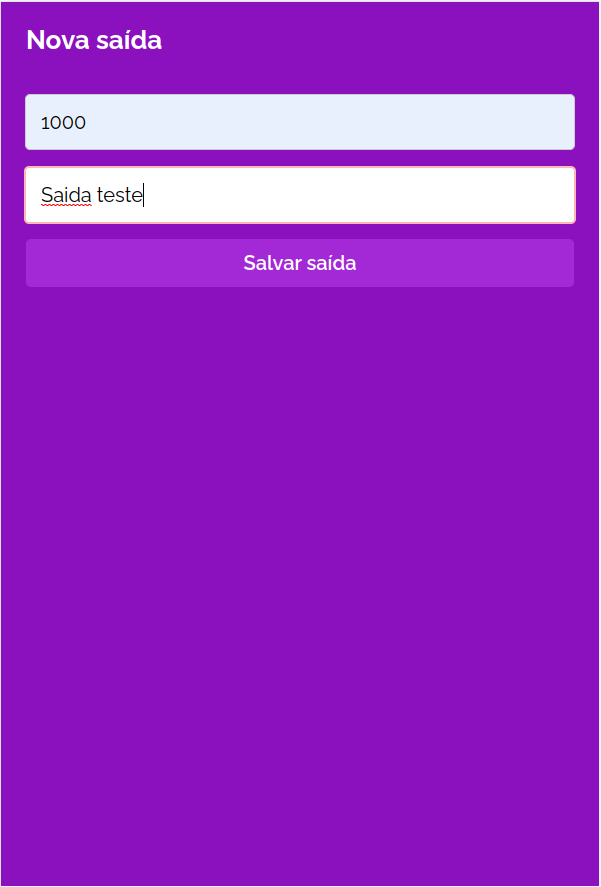

# MyWallet
_MyWallet is a robust web application built to streamline your personal finance management. With a secure and user-friendly interface, it empowers users to take control of their financial habits and track income and expenses effortlessly_. 
<table>
  <tr>
    <td align="center">
      
      <br />
      Registration Screen
    </td>
    <td align="center">
      
      <br />
      Login Screen
    </td>
  </tr>
  <tr>
    <td align="center">
      
      <br />
      Home Screen
    </td>
    <td align="center">
      
      <br />
      Create Input Operations
    </td>
  </tr>
  <tr>
    <td align="center">
      
      <br />
      Create Output Operations
    </td>
    <td align="center">
      
      <br />
      Home Screen after operations
    </td>
  </tr>
  <tr>
    <td align="center">
      
      <br />
      Update Output or Input Operations
    </td>
    <td align="center">
      
      <br />
      Delete operations
    </td>
  </tr>
</table>


Try it out now in front-end at https://projeto14-my-wallet-front-ten.vercel.app/

## About this Project
This project is a React-based web application that offers features such as registration, login, adding income and expense transactions, transaction listing, and logout. Below are the main features and requirements of the project:

- **Login Screen** (`/`)
  - Users can log in by entering their email and password, which are sent to the API.
  - During the login process, the email and password fields, are disabled to prevent duplicate actions. A loading animation is displayed during this period.
  - Users also have the option to register by clicking on a link that redirects them to the /register route.

- **Registration Screen** (`/cadastro`)
  - Users can create an account on the `/cadastro` route.
  - All fields are mandatory.
  - The email must have a valid format and must confirm your password.

- **Home Screen** (`/home`)
  - The top and menu of the application have a fixed position to facilitate navigation.
  - The user's photo is displayed at the top.
  - The menu offers three buttons that redirect users to the /habitos, /hoje, and /historico routes.
  - The "Today" button displays a circular progress bar indicating the percentage of completion of users daily habits. This percentage is automatically updated as habits are completed.

- **Input or Output Operation Screen** (`/nova-transacao/:tipo`)
  - Users can add transactions of type `entrada` or `saida` on the `/nova-transacao/:tipo` route.
  - The transaction value must be a positive floating-point number and have a description.

- **Input or Output Update Screen** (`/editar-registro/:tipo/:id`)
  - Users can update transactions by id of type `entrada` or `saida` on the `/nova-transacao/:tipo/:id` route.
  - The user can update the transactions value and the description.

- **Logout**
  - By clicking the logout button, that is the profile image, the user is logged out and redirected to the login screen.
  - Users cannot access the `/home` or `/nova-transacao` routes without being logged in, and attempting to do so redirects them to the login screen.
  - After logging out, users can log in again.

## Why
This project represents a significant achievement for me, given its comprehensiveness. It encompasses a full-fledged structure in React, a highly relevant and powerful technology. This endeavor has provided me with a deep understanding of this technology and the ability to create a robust web application.

What truly sets this project apart are its well-crafted features and the intricacies of development. Notably, it goes beyond the basics, offering a wide range of functionalities and details that add depth and complexity to the application.

In summary, this project has provided me with a learning experience, allowing me to deepen my knowledge in React, understand the nuances of web application development, and navigate the complexities of implementing features and logic within the context of a React application.

## Technologies
The following badges are the tools and technologies used in the construction of the project: 

- [](https://reactjs.org/)

- [](https://axios-http.com/)

- [](https://styled-components.com/)

- [](https://reactrouter.com/)

- [](https://react-icons.github.io/react-icons/)


## How to run for development

1. Clone this repository
2. Install all dependencies

```bash
npm i
```

3. Populate `.env` file based on `.env.example`. `REACT_APP_API_URL` should point to the MyWallet-API server

4. Run the front-end in a development environment:

```bash
npm run start
```

## Building and starting for production

```bash
npm run build
npm start
```

## Support

Reactjs is an MIT-licensed open source project. It can grow thanks to the sponsors and support by the amazing backers. If you'd like to join them, please [read more here](https://react.dev/learn).

## Stay in touch

- Github - [@reactGithub](https://github.com/facebook/react)
- Website - [https://react.dev/](https://react.dev/)
- Twitter - [@reactjs](https://twitter.com/reactjs)

## License

This project is [MIT licensed](LICENSE).
